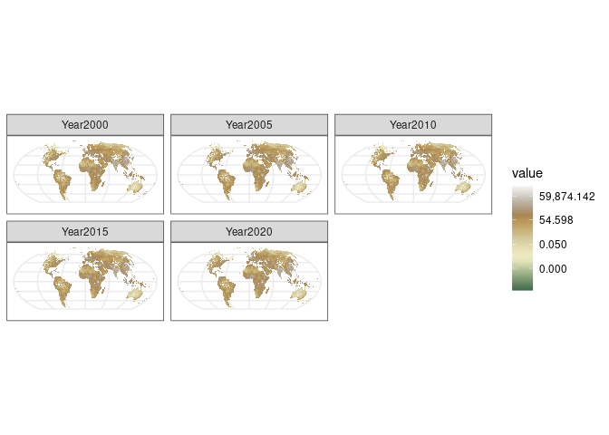

- <a href="#1-pandemic_risk_and_deforestation"
  id="toc-1-pandemic_risk_and_deforestation">1
  Pandemic_risk_and_deforestation</a>
  - <a href="#11-load-necessary-packages"
    id="toc-11-load-necessary-packages">1.1 load necessary packages:</a>
  - <a
    href="#12-mammal-species-richness-abundance-and-number-of-infected-individuals"
    id="toc-12-mammal-species-richness-abundance-and-number-of-infected-individuals">1.2
    Mammal species richness, abundance and number of infected
    individuals</a>
  - <a href="#13-population-density" id="toc-13-population-density">1.3
    Population density</a>
- <a href="#2-used-packages-and-versions"
  id="toc-2-used-packages-and-versions">2 Used Packages and Versions</a>
- <a href="#3-references" id="toc-3-references">3 References</a>

<!-- README.md is generated from README.Rmd. Please edit that file -->

# 1 Pandemic_risk_and_deforestation

<!-- badges: start -->
<!-- badges: end -->

The goal of the *Pandemic_risk_and_deforestation* is to document the
code and datasets used for the mansucript *Pandemic risk and
deforestation policies in the world tropics* this repo goes section by
section with the code

## 1.1 load necessary packages:

first we load the necessary packages

``` r
library(terra)
library(dplyr)
library(broom)
library(geodata)
library(purrr)
library(tidyterra)
library(ggplot2)
```

## 1.2 Mammal species richness, abundance and number of infected individuals

We used IUCN range maps for mammalian species in the Orders Chiroptera,
Primate, Rodentia and Ungulata gathered from the IUCN red list
(<https://www.iucnredlist.org/resources/spatial-data-download>) in
raster format to calculate species richness ($S$) for each order within
each cell. To transform number of species into number of individuals, we
used models fitted to empirical data obtained from a world database of
species richness and abundance in local communities throughout the world
(The Ecological Register (Alroy 2015).

``` r
Data <- readRDS("Alroy_Data.rds") |>  
    dplyr::filter(Goods_U > 0.9, count > 100) |>  
    dplyr::mutate(LogS = log(Richness), LogA = log(Fishers_Alpha))
```

From these relationships (for values of Goods_U \> 0.9 and counts of
more of a 100), we then calculated the expected abundance for each cell
$S$

``` r
powerlaw.model <- nls(Fishers_Alpha~a*Richness^y, start= list(y=0, a = 1), data =Data)
```

see results in table <a href="#tab:tableNLS">1.1</a>

| term | estimate | std.error | statistic | p.value |
|:-----|---------:|----------:|----------:|--------:|
| y    |    1.056 |     0.008 |   138.742 |       0 |
| a    |    0.198 |     0.007 |    28.702 |       0 |

<span id="tab:tableNLS"></span>Table 1.1: Parameters from the non linear
model for the power law of fishers alpha

## 1.3 Population density

We calculated the population density based on (Center for International
Earth Science Information Network - CIESIN - Columbia University 2018),
at 2.5 min resolution, and then multiply them by the area to get total
population, that is then transformed to equal area projection to make it
consistent

``` r
population <- seq(2000, 2020, by = 5) |>
  purrr::map(~geodata::population(year = .x, res = 2.5, path = getwd())) |> 
  purrr::reduce(c)

# Multiply by area

population <- population*terra::cellSize(population[[1]], unit = "km")

# Transform to equal area

population <- terra::project(population, "+proj=moll +lon_0=0 +x_0=0 +y_0=0 +ellps=WGS84 +units=m +no_defs")

names(population) <- paste0("Year", seq(2000, 2020, by = 5))

# save to cloud optimized geotif
terra::writeRaster(x = population, filename = "Population.tif", overwrite = TRUE, gdal = c("COMPRESS=DEFLATE", "TFW=YES", "of=COG"))
```

This looks like this in the log scale in figure
<a href="#fig:ShowPopulation">1.1</a>

<div class="figure">



<p class="caption">

<span id="fig:ShowPopulation"></span>Figure 1.1: Population by pixel in
the world

</p>

</div>

# 2 Used Packages and Versions

- **knitr**: 1.45
- **ggplot2**: 3.4.4
- **tidyterra**: 0.4.0
- **purrr**: 1.0.2
- **geodata**: 0.5-8
- **broom**: 1.0.5
- **dplyr**: 1.1.4
- **terra**: 1.7-73

In this code, `sessionInfo()$otherPkgs` is used to extract the loaded
packages during the rendering of the R Markdown document. We then
extract the package names and versions from this information and format
it into a Markdown list, excluding base and recommended packages.

# 3 References

<div id="refs" class="references csl-bib-body hanging-indent">

<div id="ref-alroy2015shape" class="csl-entry">

Alroy, John. 2015. “The Shape of Terrestrial Abundance Distributions.”
*Science Advances* 1 (8): e1500082.

</div>

<div id="ref-ciesin2018" class="csl-entry">

Center for International Earth Science Information Network - CIESIN -
Columbia University. 2018. “Gridded Population of the World, Version 4
(GPWv4): Population Density, Revision 11.” Palisades, NY: NASA
Socioeconomic Data and Applications Center (SEDAC).
<https://doi.org/10.7927/H49C6VHW>.

</div>

</div>
